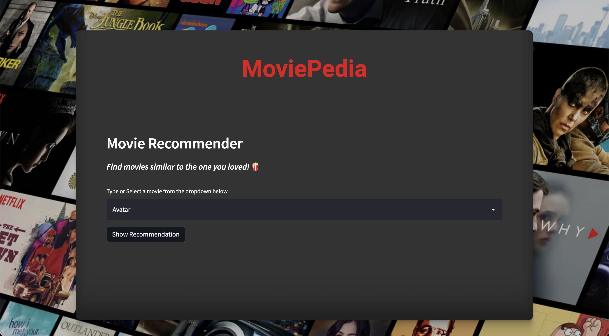
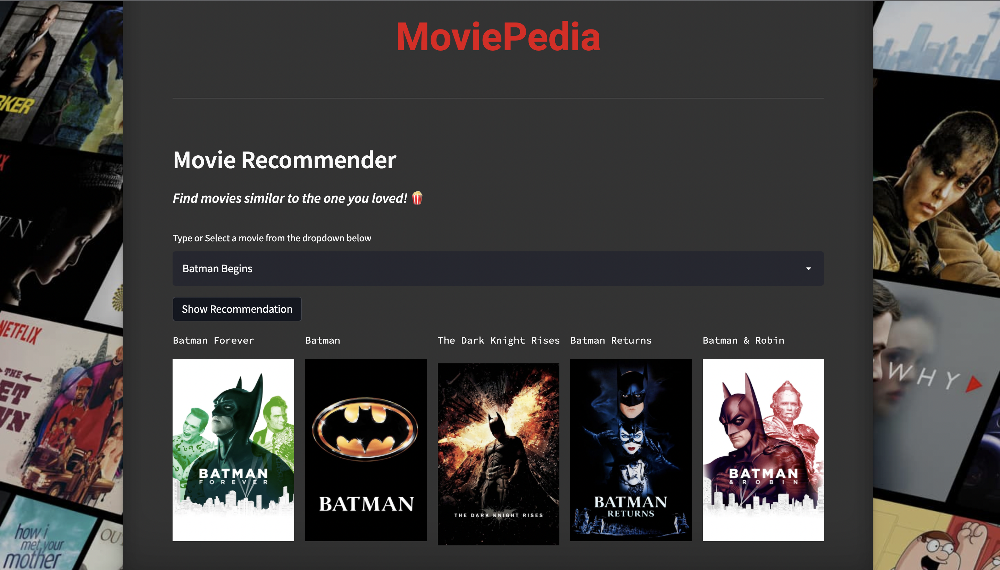

# MoviePedia : Content-Based-Movie-Recommender-System


Content Based Recommender System uses attributes such as genre, director, description, actors, etc. for movies, to make suggestions for the users. The intuition behind this sort of recommendation system is that if a user liked a particular movie or show, he/she might like a movie or a show similar to it.

# MoviePedia
 
MoviePedia is a simple movie recommendation system that recommends similar movies on the basis of overview and genre.

The posters of the movies are fetched using an API by TMDB, https://www.themoviedb.org/documentation/api

I have deployed my web application on streamlit.

Link to my app : https://share.streamlit.io/gunjangupta26/moviepedia_movie-recommmender/main/app.py








---
## Algorithm Used

<b>Sigmoid Kernel</b>: This function is equivalent to a two-layer, perceptron model of the neural network, which is used as an activation function for artificial neurons.

k(x, y) = tanh (alpha x^T y + c) 


sigmoid kernel graph
# Installation 

1. Clone or download this repository to your local machine.

2. Install all the libraries mentioned in the `requirements.txt` file.


# Reproducing this web app
To recreate this web app on your own computer, do the following.

### Install prerequisite libraries

Download requirements.txt file

```
wget https://github.com/GunjanGupta26/MoviePedia_movie-recommmender/blob/main/requirements.txt

```

Pip install libraries
```
pip install -r requirements.txt
```

###  Download and unzip contents from GitHub repo

Download and unzip contents from https://github.com/GunjanGupta26/MoviePedia_movie-recommmender/archive/refs/heads/main.zip

### Generating the PKL file

The movie recommendation model used in this web app will firstly have to be generated by successfully running the [Movie_Recommendation_System_.ipynb](https://github.com/GunjanGupta26/MoviePedia_movie-recommmender/blob/main/Movie_Recommendation_System_.ipynb) file on your preferred environment. Upon successfully running all code cells, a pickled model called model1.pkl will be generated.

###  Launch the app

Run the following command in your terminal,

```
streamlit run app.py
```